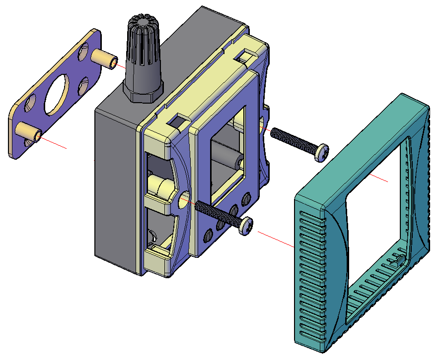
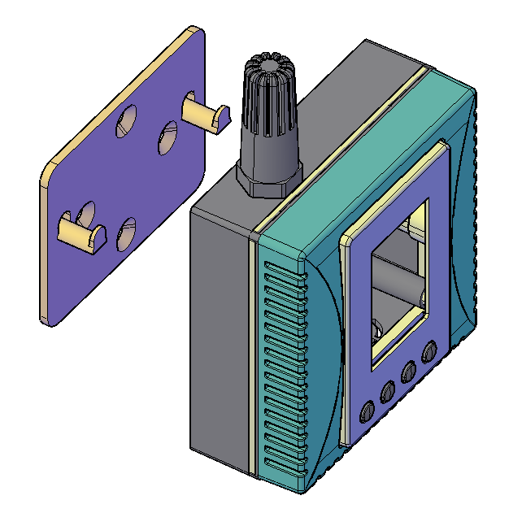

.. _installation-guide:

Installation Guide
==================

The product supports two installation methods:

Method 1: Backplate Bracket + Screw Fixation
--------------------------------------------

This method involves installing a backplate bracket and securing the device to a wall or surface using screws.

   Figure: Backplate bracket + screw fixation method

Method 2: Hook Mount Installation
---------------------------------

This method involves mounting the device using hooks on a wall or other supporting structure.

   Figure: Hook mount installation method